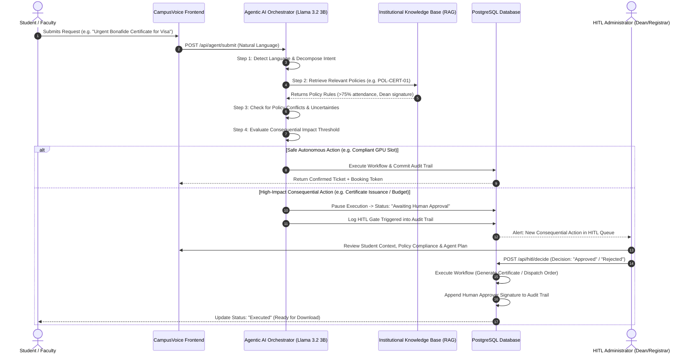

# SOAIDEATHON-S1: Human-in-the-Loop Agentic AI for Autonomous Institutional Service Delivery

## 1. Executive Summary & Problem Mapping
This platform directly addresses **SOAIDEATHON-S1** by providing an enterprise-grade **Human-in-the-Loop (HITL) Agentic AI** ecosystem for autonomous institutional service delivery at SOA University.

### Key Capabilities:
1. **Multi-Step Action Planning**: Breaks natural language intent into deterministic execution graphs (`Parse` → `RAG Policy Verification` → `Constraint Check` → `HITL Gate` → `Execute`).
2. **Four Unified Institutional Workflows**:
   - 📜 **Certificate Requests** (Bonafide, Transcripts, NOC, Character Certificate with digital authorization)
   - 🔧 **Maintenance Tickets** (Hostel plumbing, electrical emergencies, lab AC & asset repair)
   - 🔬 **Laboratory Bookings** (GPU Cluster, Robotics testbeds, Chemistry analyzers with conflict detection)
   - ⚖️ **Grievance Escalation** (Scholarship fund delays, Exam re-evaluation discrepancies, Academic issues)
3. **Human-in-the-Loop (HITL) Safeguard**:
   - Autonomous execution is permitted for safe, non-consequential operations (e.g. routine plumbing work orders, compliant GPU cluster slots).
   - High-impact / consequential actions (certificate digital seal, budget authorizations, high-priority escalations) automatically pause at a **HITL Gate** and require administrator sign-off.
4. **Auditable Action Trail**:
   - An immutable chronological ledger records every agent thought, tool call, cited policy code, human approver signature, and execution outcome.
5. **Verified Knowledge Retrieval (RAG) & Policy Conflict / Uncertainty Detection**:
   - Cross-references requests against institutional guidelines (e.g. `POL-CERT-01`, `POL-LAB-01`, `POL-MAINT-01`, `POL-GRIEV-01`).
   - Detects policy contradictions or ambiguous student requests instead of hallucinating answers.
6. **Multilingual Interaction**:
   - Supports natural language inputs and prompt templates in **English, Hindi, and Odia**.

---

## 2. Agentic Architecture & Sequence Diagram

---

## 3. Database Schema

- **`users`**: User identities, roles (`user`, `admin`), password hashes.
- **`service_requests`**: Unified domain records (`request_type`, `title`, `description`, `category`, `status`, `priority`, `detected_language`, `agent_plan`, `policy_citations`, `requires_hitl`, `hitl_reason`, `execution_result`).
- **`audit_logs`**: Immutable step-by-step reasoning and decision trail (`step_number`, `actor`, `action`, `details`, `policy_ref`, `timestamp`).
- **`knowledge_base`**: Institutional policy codes, constraints, and SLA rules.
