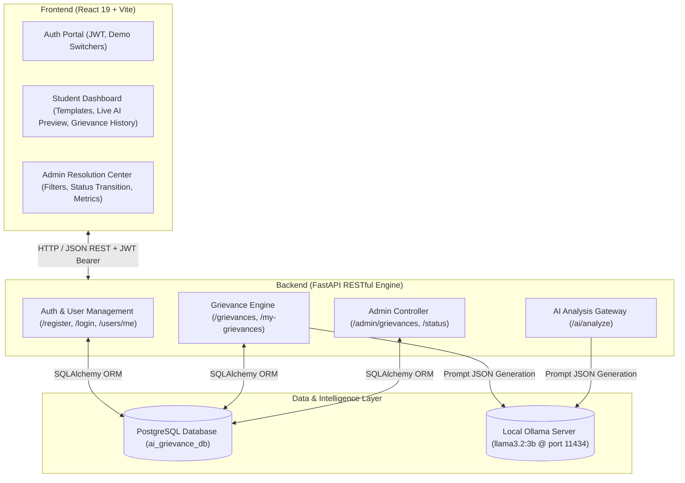

# College Grievance Management System — Architecture & Design

## 1. System Overview
The **CampusVoice AI College Grievance Management System** is a full-stack, AI-powered enterprise platform designed to modernize college administration. It automates the intake, analysis, triage, and resolution lifecycle of student and faculty grievances using a locally hosted Large Language Model (**Ollama Llama 3.2 3B**) and **PostgreSQL**.

---

## 2. Architectural Diagram

---

## 3. Database Schema

### Users Table (`users`)
| Column | Type | Constraints | Description |
|---|---|---|---|
| `id` | `INTEGER` | Primary Key, Auto-increment | Unique identifier |
| `name` | `VARCHAR(100)` | Not Null | User's full name |
| `email` | `VARCHAR(150)` | Unique, Not Null, Indexed | Login email address |
| `hashed_password` | `VARCHAR(255)` | Not Null | Argon2 / Bcrypt password hash |
| `role` | `VARCHAR(50)` | Default `'user'` | Role: `'user'` or `'admin'` |
| `created_at` | `TIMESTAMP WITH TIME ZONE` | Default `NOW()` | Account creation time |

### Grievances Table (`grievances`)
| Column | Type | Constraints | Description |
|---|---|---|---|
| `id` | `INTEGER` | Primary Key, Auto-increment | Grievance ticket number |
| `user_id` | `INTEGER` | Foreign Key (`users.id`), Not Null | Submitting student |
| `title` | `VARCHAR(200)` | Not Null | Brief title of issue |
| `description` | `TEXT` | Not Null | Detailed problem statement |
| `category` | `VARCHAR(100)` | Not Null | AI-classified category |
| `status` | `VARCHAR(50)` | Default `'Pending'` | Lifecycle state: `Pending`, `In Progress`, `Resolved`, `Rejected` |
| `priority` | `VARCHAR(50)` | Default `'Medium'` | AI Urgency: `Low`, `Medium`, `High` |
| `ai_summary` | `TEXT` | Nullable | 1-2 sentence AI summary |
| `created_at` | `TIMESTAMP WITH TIME ZONE` | Default `NOW()` | Submission timestamp |
| `updated_at` | `TIMESTAMP WITH TIME ZONE` | Default `NOW()` | Last status update timestamp |

---

## 4. AI & Local LLM Integration

### Ollama Model Configuration
- **Model**: `llama3.2:3b`
- **Endpoint**: `http://localhost:11434/api/generate`
- **Structured Decoding**: Configured with `format: "json"` for 100% deterministic JSON schemas.
- **Allowed Categories**: `Academic`, `Scholarship`, `Hostel`, `Examination`, `Fees`, `Other`
- **Allowed Priorities**: `Low`, `Medium`, `High`

### Resilient Fallback Engine
If Ollama is temporarily offline or processing a heavy task, the backend automatically intercepts network errors and uses a heuristic classifier so student submissions are never blocked or lost.
